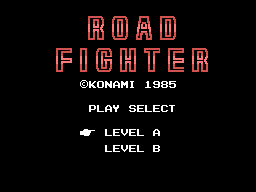
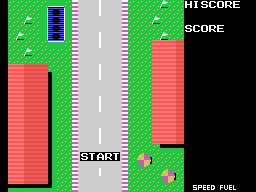
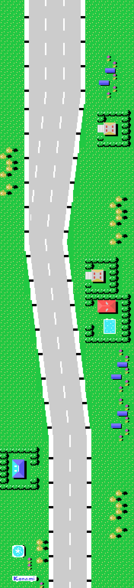
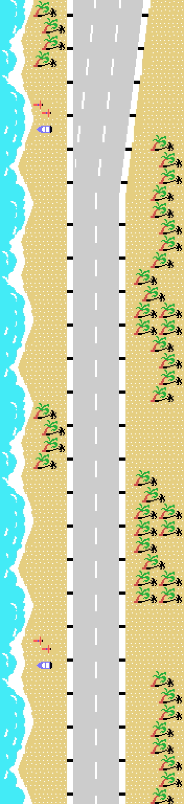
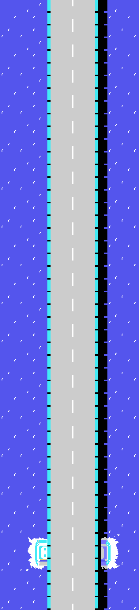
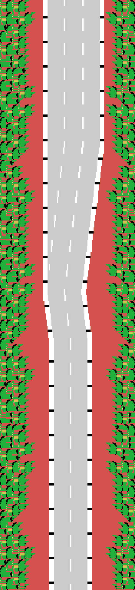
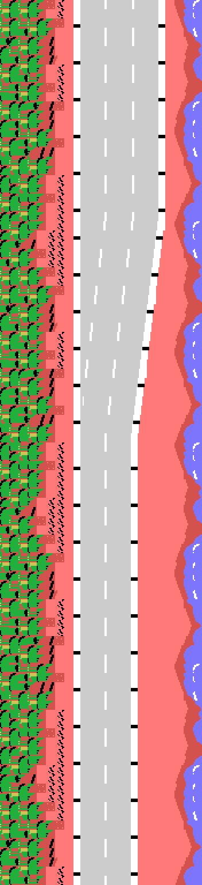
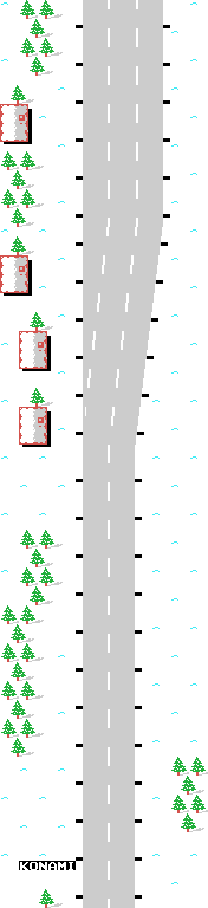
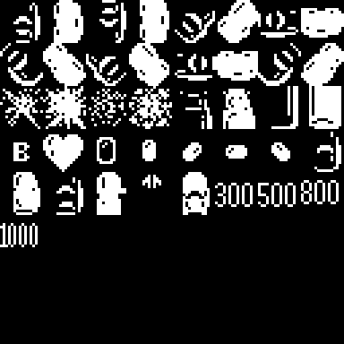

# El juego

*Road Fighter* es una carrera vista desde arriba. Se conduce un coche por una
carretera que baja por la pantalla, esquivando a los demás, sin salirse del
arcén y sin quedarse sin gasolina. Konami lo publicó para MSX en 1985 con el
número de catálogo **RC-730**, y son 16 KB.

La portada la monta el cartucho paso a paso. El rótulo grande entra
deslizándose desde los dos lados, y por eso la palabra ROAD está guardada **al
revés** en la ROM, con su 0xFF por delante: se lee hacia atrás mientras entra.

## Seis etapas, y luego otra vuelta

Hay **seis etapas**. Al pasar la sexta, el contador de 0x4394 no se para: la
deja en uno y sube el contador de vueltas de 0xE042, así que el juego vuelve a
empezar contando cuántas veces se ha completado.

Cada etapa tiene su decorado, su calzada y su guion de paisaje. Sólo hay
**cinco decorados para seis etapas**: la 4 y la 5 comparten el suyo, y lo que
las distingue es el tono que les da la tabla de 0x6A69.

## LEVEL A y LEVEL B

En la portada se elige entre dos niveles, y no es un multiplicador de
dificultad. El nivel vive en (0xE03B) y se mete por medio en cuatro sitios
distintos del cartucho:

| dónde | qué cambia |
|---|---|
| 0x706D | dobla o no el empuje lateral con el que salen los objetos |
| 0x7374 | el paso del gasto de gasolina: 0x0180 contra 0x01FF |
| 0x6F72 | la cuenta de espera del reparto de objetos: siete o doce |
| 0x7044 | **suprime un tramo entero**: el 0x0A se cambia por el 9 |

## La salida

La pantalla de salida no sale de ninguna lista ni de ningún mapa. La monta a
mano la rutina de 0x77C8: primero llena el anillo entero de hierba con un
`lddr` de 0x225 bytes y después va pegando ocho retales, uno detrás de otro,
heredando cada llamada el destino que dejó la anterior. Por eso a veces sólo se
le cambia el registro E entre una y otra.

## Las seis carreteras

Ninguna de estas imágenes es una captura. Están dibujadas **ejecutando el motor
de carretera del cartucho** en Python, rutina por rutina, y comprobadas contra
openMSX: en los 264 pasos cotejados —cuarenta y cuatro por etapa— el anillo
entero de 528 bytes y todas las variables del generador salieron idénticos a
los de la máquina.

**Se leen de abajo arriba**, que es como se recorren: la línea de salida y el
rótulo de Konami están al pie de la tira, y la meta arriba del todo. El motor
saca las filas en el orden en que asoman por el borde superior de la pantalla,
así que apilarlas al revés dejaría boca abajo todo lo que ocupa más de una fila
—los abetos de la sexta etapa, sin ir más lejos—.

### Etapa 1

Casas con seto, la piscina, coches aparcados, las pistas de tenis y un cartel
de Konami cerca del principio.

### Etapa 2

La playa. Las cuatro columnas de la izquierda salen de una lista cíclica propia
de esta etapa, la de 0x7DC5, que se recorre de cuatro en cuatro y vuelve a
empezar al topar con un 0xFF.

### Etapa 3

La única que dibuja la fila entera desde una palabra de dieciséis bits, y la
única con tiles de calzada propios: 0x9B y 0x04 en vez de 0x80 y 0x0F.

### Etapa 4

La curva en S. Sólo están guardadas las siete columnas de un lado; las del otro
se calculan sumando 0x0D a cada tile.

### Etapa 5

La que separa las dos compilaciones del cartucho: el byte 0x53CB, el único que
las diferencia, es el decimoquinto tramo de esta fila del plan.

### Etapa 6

La última. Es la única que remata con **GOAL** en vez de CHECK POINT, y trae su
propio juego de guiones, que no comparte con ninguna otra.

## El coche

El coche son **dos sprites en el mismo sitio**: uno con la carrocería y otro,
cuatro patrones más allá, con su color. En el MSX1 un sprite lleva un solo
color, así que superponer dos es la única forma de que tenga dos.

En la hoja están también las explosiones, las banderas y los rótulos de puntos
que salen al adelantar: **300, 500, 800 y 1000**.
